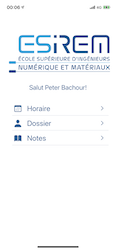

# OGE - ESIREM (Outils de Gestion des Etudiants)

Cette application développé en swift 5.0 sur Xcode permet à ses utilisateurs qui sont générallement des étudiants de voir leurs **notes**, leurs **dossiers** et leurs **horaires**.

## Authentification

Une page d'authentification se trouve au lancement de l'application. Pour des raisons de simplicité et une contrainte de temps, le nom de l'utilisateur et le mot de passe ont été réglé manuellement.

- nom de l'utilisateur est **PeterBachour**
- le mot de passe est **ios2020**

## Usage

Une fois authentifier une page d'accueil est affichée. L'utilisateur a 3 choix devant lui:
- choisir de voir son horaire
- choisir de voir son dossier
- choisir de voir ses notes

### Horaire

Pour le moment cette page n'a pas été programmé encore.

### Dossier

L'utilisateur pourra voir ses données personelles ainsi de les modifier grace un bouton edit.

### Notes

L'utilisateur aura accès à ses notes en général et a aussi la capacité de générer un PDF de ses notes. Il a aussi le droit de voir le détail de ses notes.

## Travail futur
Les modifications qui pourront être apporter dans le futur pour ce projet sont les suivantes:
- La page Horaire ainsi que tous les événements grace à la libraire *FSCalendar*
- L'ajout d'authentification grace à l'outil *FireBase*

## Autheur
Peter Bachour (peter_bachour@icloud.com)
